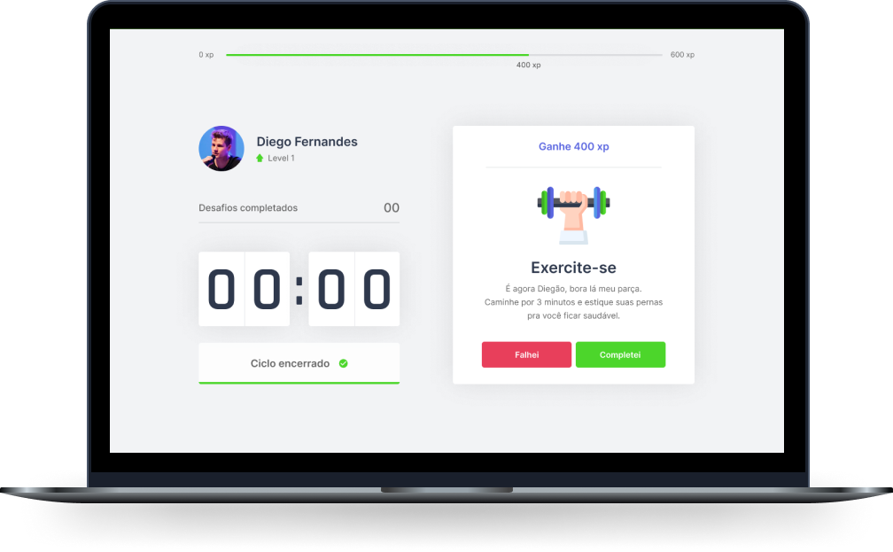

<h1 align="center">
    
</h1>

    

## :rocket: Tecnologias

Foram usadas as seguintes tecnologias:

- [Next.js](https://nextjs.org/)
- [React](https://reactjs.org)
- [Typescript](https://www.typescriptlang.org)

## :computer: Projeto

Projeto desenvolvido durante a 4ª edição do Next Level Week pela [Rocketseat](https://rocketseat.com.br), para utilizar exercícios físicos para quem passa muito tempo na frente do computador, utilizando a técnica de [Pomodoro](https://brasilescola.uol.com.br/dicas-de-estudo/tecnica-pomodoro-que-e-e-como-funciona.htm).

## :thinking: Como rodar o projeto?

1. Rodar `yarn install` no terminal para instalar as dependências

2. Depois executar `yarn dev` para inicializar o servidor

3. Abrir no navegador a url http://localhost:3000 e visualizar o projeto rodado.
